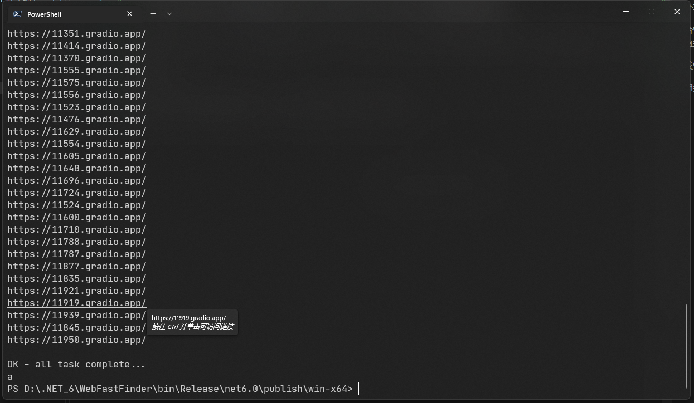

# WebFastFinder

一个基于HTTPClient测试gradio上Stable diffusion的快速查找器

配合Windows10,11 默认的Windows Terminal(Windows终端)使用更佳,可直接通过[Ctrl+鼠标单击]访问链接

NOTE: !!!!!: 程序只在爬取完区间内所有链接后才会保存URL到txt文件!!!!!

开发细节:

使用多线程高速筛取链接, ban关键词和sd关键词过滤

